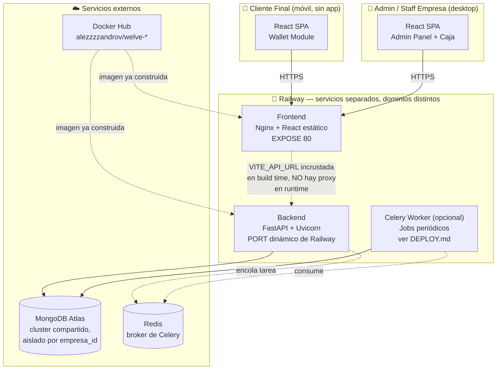
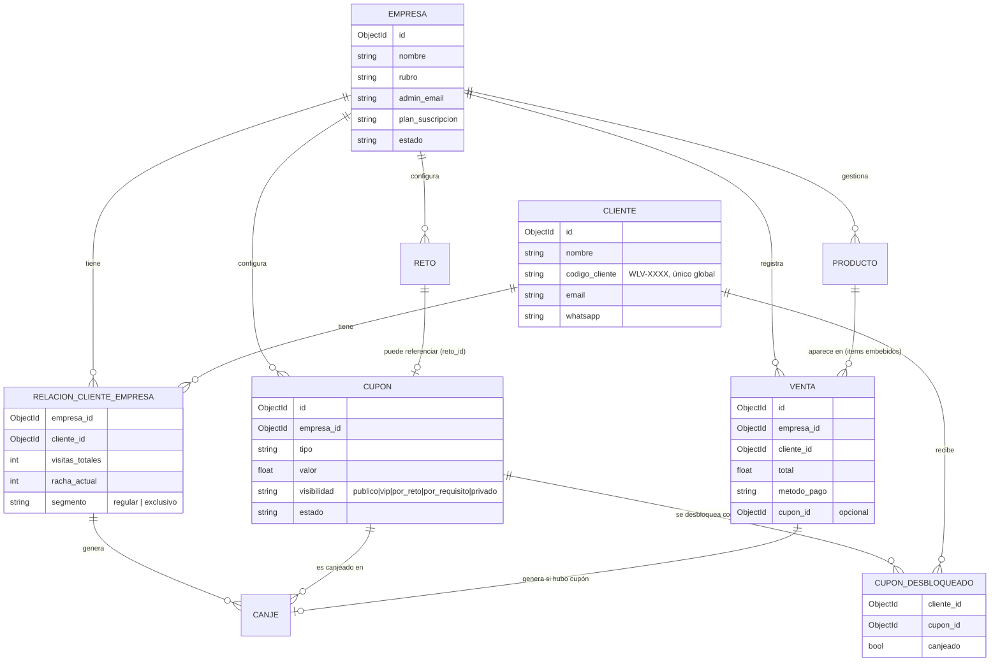
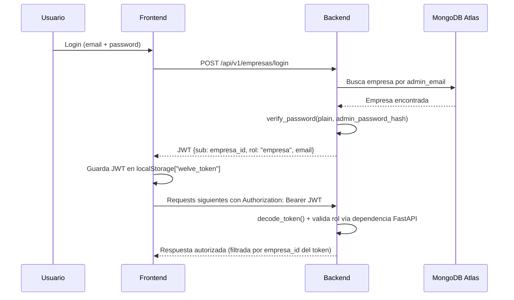

# Arquitectura — Welve

## Stack tecnológico completo

| Capa | Tecnología | Versión | Propósito |
|---|---|---|---|
| Lenguaje backend | Python | 3.11 | Runtime del API |
| Framework API | FastAPI | 0.115.5 | Routing, validación, docs OpenAPI automáticas |
| Servidor ASGI | Uvicorn | 0.32.1 | Corre la app FastAPI |
| ODM | Beanie | 1.27.0 | Documentos Mongo tipados con Pydantic |
| Driver Mongo async | Motor | 3.6.0 | Cliente async subyacente de Beanie |
| Base de datos | MongoDB Atlas | — | Cloud, un solo cluster compartido, aislado por `empresa_id` |
| Validación / settings | Pydantic + pydantic-settings | 2.10.3 / 2.6.1 | Schemas de entrada/salida y config por env vars |
| Auth | python-jose + passlib[bcrypt] | 3.3.0 / 1.7.4 | JWT y hash de contraseñas |
| Cola de tareas | Celery | 5.4.0 | Jobs periódicos (romper rachas, expirar cupones, etc.) |
| Broker/backend de cola | Redis | 5.2.1 (cliente) | Broker de Celery y result backend |
| Framework frontend | React | 18.3.1 | UI |
| Build tool | Vite | 6.0.3 | Dev server + build de producción |
| Lenguaje frontend | TypeScript | 5.7.2 | Tipado estático |
| Estilos | TailwindCSS | 3.4.16 | Utility-first CSS |
| Estado de servidor | TanStack React Query | 5.62.7 | Cache/fetch de datos del API |
| Cliente HTTP | Axios | 1.7.9 | Requests al backend |
| Formularios | React Hook Form + Zod | 7.80.0 / 4.4.3 | Formularios + validación de schema |
| Gráficos | Recharts | 3.9.0 | Charts del dashboard admin |
| Íconos | lucide-react | 1.22.0 | Librería de íconos única del proyecto |
| Ruteo | React Router | 7.0.2 | Ruteo del SPA |
| Mapas | Leaflet + react-leaflet | 1.9.4 / 4.2.1 | Ubicación de empresas en mapa |
| Scanner QR/barcode | html5-qrcode | 2.3.8 | Cámara del navegador para escanear códigos |
| Contenedores | Docker (multi-stage) | — | Imágenes de backend y frontend |
| Servidor estático | Nginx | 1.27-alpine | Sirve el build de React en producción |
| Deploy | Railway | — | Hosting de ambos servicios, imágenes desde Docker Hub |
| Registro de imágenes | Docker Hub | — | `alezzzzandrov/welve-backend`, `alezzzzandrov/welve-frontend` |

## Diagrama de arquitectura general



**Nota importante**: a diferencia de `docker-compose.yml` (donde frontend y
backend comparten red interna y nginx hace de proxy `/api/` → `backend:8000`),
en Railway son dos servicios con dominios públicos distintos. El frontend le
pega directo al dominio del backend usando `VITE_API_URL`, que Vite incrusta
en el bundle JS **en build time** — no es una variable de entorno que se lea
en runtime. Ver `frontend/src/api/client.ts` y `DEPLOY.md`.

## Arquitectura de carpetas del backend

```mermaid
graph LR
    MAIN["main.py\nlifespan + CORS\n+ registro de routers"] --> ROUTERS
    subgraph ROUTERS["routers/ (17 módulos)"]
        R1[empresas.py]
        R2[cupones.py]
        R3[wallet.py]
        R4[staff.py]
        R5[ventas.py]
        R6[productos.py]
        R7[metricas.py]
        R8[qr.py]
        R9[retos.py]
    end
    ROUTERS --> SERVICES
    subgraph SERVICES["services/ (26 archivos)"]
        S1[empresa_service]
        S2["cupon_service, cupon_acceso_service,\ncupon_desbloqueo_service"]
        S3[venta_service]
        S4[visita_service]
        S5[progreso_service]
        S6[recompensas_engine]
    end
    SERVICES --> MODELS
    subgraph MODELS["models/ (17 documentos Beanie + enums.py)"]
        M1[Empresa]
        M2[Cliente]
        M3[Cupon / CuponDesbloqueado]
        M4[Venta / Producto]
        M5[Canje]
        M6[Reto]
        M7[RelacionClienteEmpresa]
    end
```



Cada dominio sigue el mismo patrón de 4 capas: `models/<dominio>.py`
(documento Beanie) → `schemas/<dominio>.py` (Pydantic de entrada/salida) →
`services/<dominio>_service.py` (lógica de negocio, único lugar que toca
Beanie) → `routers/<dominio>.py` (endpoints HTTP, expuestos bajo
`/api/v1/<dominio>`).

Cuando un servicio crece más de ~200 líneas, se divide por responsabilidad en
vez de seguir creciendo — por ejemplo, el motor de cupones flexibles no es un
solo `cupon_service.py` gigante, sino tres archivos separados:
`cupon_acceso_service.py` (solo lectura: ¿puede ver/canjear este cliente?),
`cupon_desbloqueo_service.py` (solo escritura: desbloquear) y
`cupon_validacion_service.py` (vigencia/estado/límites, compartido por
ambos).

### Patrón de capas — ejemplo real

```python
# routers/cupones.py — el router NO toca Beanie directamente
@router.post("", response_model=CuponResponse, status_code=201)
async def crear_cupon(data: CuponCreate, empresa: Empresa = Depends(get_current_empresa)):
    cupon = await cupon_service.crear_cupon(empresa.id, data)
    return cupon_service.cupon_to_response(cupon)

# services/cupon_service.py — única capa que toca Beanie
async def crear_cupon(empresa_id: PydanticObjectId, data: CuponCreate) -> Cupon:
    cupon = Cupon(empresa_id=empresa_id, **data.model_dump())
    await cupon.insert()
    return cupon
```

El error HTTP (`HTTPException`) se lanza siempre en el router, nunca en el
service — la única excepción documentada es `canje_service.crear_canje()`,
que retorna una tupla `(canje, error_msg)` porque necesita comunicar fallas
de negocio sin cortar el flujo con una excepción.

## Schema de base de datos (colecciones principales)



`Venta.items` es una lista de `ItemVenta` **embebida** dentro del documento
(snapshot de producto/precio al momento de la venta), no una colección
aparte — por eso no aparece como entidad propia en el diagrama. Ver
`DATABASE.MD` para el schema completo de las 17 colecciones, incluyendo
`membresias`, `membresias_clientes`, `notificaciones`, `historial_visitas`,
`resenas`, `movimientos_inventario`, `pagos` y `welve_admins`.

## Flujo de autenticación



Hay **tres tipos de token JWT que nunca se mezclan**: `empresa` (admin del
negocio, incluye Staff/Caja), `cliente` (wallet, con o sin `empresa_id` según
el endpoint) y `superadmin`/`soporte` (staff interno de Welve). Cada uno usa
una dependencia FastAPI distinta (`get_current_empresa_admin`,
`get_current_cliente` / `get_global_cliente`, `get_current_super_admin`) —
fuente de verdad en `backend/app/core/dependencies.py`.

## Decisiones de arquitectura

- **MongoDB en vez de SQL**: el modelo de dominio (cupones con condiciones
  variables, retos con distintos tipos de meta) encaja mejor con documentos
  flexibles que con un schema relacional rígido; y el aislamiento
  multi-tenant por campo (`empresa_id`) es más simple que gestionar N
  schemas o bases de datos separadas.
- **Beanie sobre PyMongo directo**: da validación Pydantic gratis sobre cada
  documento y una API async ergonómica, sin perder acceso a Motor cuando se
  necesita una query cruda.
- **React Query en vez de Redux**: el estado de la app es mayormente "datos
  del servidor con cache" (cupones, clientes, métricas) — React Query cubre
  eso sin el boilerplate de un store global para casi nada de estado
  puramente de cliente.
- **Railway en vez de AWS/GCP**: simplicidad de setup para un proyecto
  académico — deploy de una imagen Docker con un healthcheck y variables de
  entorno, sin gestionar VPCs, load balancers ni IAM a mano.
- **Docker Hub como origen de las imágenes**: separa el build (local o CI)
  del deploy — Railway solo necesita saber qué imagen correr, no tiene que
  reconstruir desde el repo cada vez, y las imágenes son reproducibles fuera
  de Railway también (`docker run` local para debug, ver `DEPLOY.md`).
