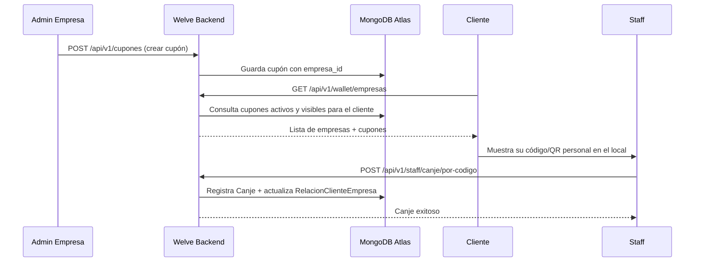
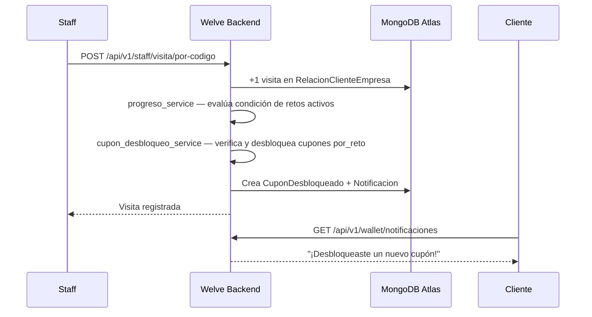
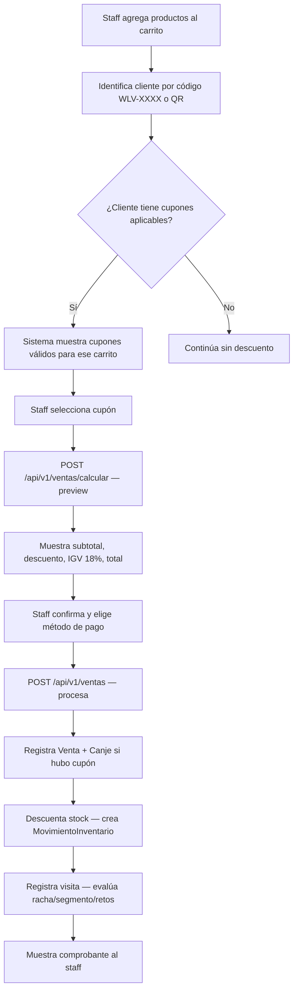

# Reglas de negocio — Welve

> Resumen funcional pensado para lectura rápida. La fuente de verdad
> detallada de reglas es [`PRODUCT.MD`](./PRODUCT.MD) (misma carpeta); este
> documento la reorganiza por módulo y agrega los flujos principales.

## Resumen ejecutivo

Welve es una plataforma SaaS B2B que digitaliza la fidelización de negocios
físicos (cafeterías, salones de belleza, retail) — reemplaza tarjetas
perforadas y stickers por cupones, retos y rachas de visita configurables
desde un panel web, consumidos por el cliente final sin instalar nada.

**Modelo de negocio**: suscripción mensual B2B (planes Starter/Growth/Pro).
Welve **no cobra comisión por canje ni por venta** — el costo del descuento
que la empresa ofrece a sus clientes es 100% de la empresa. Welve monetiza
únicamente la suscripción de plataforma.

## Actores del sistema

| Actor | Rol (JWT) | Acceso | Descripción |
|---|---|---|---|
| Super Admin Welve | `superadmin` / `soporte` | Email + password, `/api/v1/admin/auth` | Staff interno de Welve (`WelveAdmin`), gestiona la plataforma en sí — no pertenece a ningún tenant. |
| Admin de Empresa | `empresa` | Email + password, `/api/v1/empresas/login` | Dueño/administrador del negocio (tenant). Configura cupones, retos, productos, y ve métricas de su empresa. |
| Staff / Cajero | `empresa` (mismo JWT) | Panel de Caja y Staff | **No existe un rol propio en v1** — el personal del local opera con el mismo JWT del admin de empresa. Registra visitas/canjes de clientes identificándolos por `codigo_cliente` o QR, y procesa ventas en el módulo Caja. |
| Cliente Final | `cliente` | Magic link / QR (o email+password si elige registrarse así), sin prefijo propio de empresa en `/api/v1/wallet` | Consumidor B2C. Puede pertenecer a varias empresas a la vez. Ve su wallet, retos activos y su historial. |

## Módulos y funcionalidades

### Cupones

Descuentos configurados por la empresa. Tipos: `porcentual`, `monto_fijo`,
`producto_gratis`, `dos_por_uno`, `n_por_m`, `envio_gratis`, `personalizado`.

1. Un cupón con `fecha_expiracion` vencida **nunca** es canjeable, aunque su
   campo `estado` siga en `activo` — se valida en tiempo real, no se confía
   solo en el estado guardado.
2. `limite_usos_total` (global) y `limite_usos_por_cliente` son
   independientes y ambos opcionales.
3. Visibilidad flexible (`publico` / `vip` / `por_reto` / `por_requisito` /
   `privado`): un cupón `por_reto`/`por_requisito` primero se **desbloquea**
   (`CuponDesbloqueado`) cuando el cliente cumple la condición — desbloquear
   no es lo mismo que canjear, el cliente igual tiene que mostrar su QR al
   staff para el canje final.
4. Un cupón `vip` solo lo ve un cliente cuyo segmento en esa empresa sea
   `exclusivo`.
5. Cada cupón tiene un `codigo` corto (`CUP-XXXX`, único global) para que el
   staff lo identifique rápido en Caja sin buscarlo por nombre.
6. En el módulo Caja, `aplica_a` (`todo` / `productos_especificos` /
   `categoria`) + `monto_minimo_carrito` validan el cupón contra el carrito
   completo — es una condición distinta de `monto_minimo`, que es por compra
   individual fuera de Caja.

### Retos

Metas configurables con recompensa. Tipos de condición: `num_visitas`,
`visitas_en_periodo`, `monto_acumulado`, `monto_en_periodo`,
`productos_comprados`, `puntos_acumulados`, `monto_en_productos`.

1. `condicion_valor` es la meta a alcanzar; `periodo_dias` es obligatorio
   solo para las variantes `*_en_periodo`.
2. La recompensa puede ser automática (`recompensa_cupon_id`: se otorga y
   canjea sola al completar el reto) o de desbloqueo (un `Cupon` con
   `visibilidad=por_reto` apuntando a ese `reto_id`: el cliente lo desbloquea
   pero igual tiene que canjearlo con el staff).
3. Un reto próximo a vencer dispara notificación a todos los clientes
   afiliados a esa empresa (job `notificar_retos_activos`, cada 15 min).
4. `mostrar_progreso_publico` permite que el cliente vea su progreso aunque
   el cupón final sea `privado`.

### Caja (POS)

Catálogo de productos + checkout de ventas + cobro simulado de la
suscripción de la empresa a Welve.

1. `POST /ventas/calcular` (preview, solo lectura) y `POST /ventas`
   (procesa) repiten el mismo cálculo de precios + cupón + IGV (18% fijo) —
   así el staff ve exactamente lo que se va a cobrar antes de confirmar.
2. `POST /ventas` es una única operación que: descuenta stock del producto
   (crea un `MovimientoInventario`), registra la visita del cliente (misma
   lógica de racha/segmento que usa el flujo de Staff), y si hubo cupón
   aplicado crea también un `Canje` — una venta con cupón deja tanto un
   documento `Venta` como un `Canje` inmutable.
3. **Regla anti-fraude**: el cliente nunca puede registrarse una visita a sí
   mismo. Toda visita o canje posterior a la afiliación inicial lo registra
   el staff (con su JWT de empresa), identificando al cliente por
   `codigo_cliente` o escaneando su QR personal.

### Inventario

1. `Producto.gestionar_inventario` decide si el producto lleva stock —
   servicios (ej. "Corte de cabello") no lo necesitan.
2. Cada cambio de stock (venta, ajuste manual, entrada, devolución) genera un
   `MovimientoInventario` inmutable, nunca se sobreescribe el historial.
3. `stock_minimo` dispara una alerta visible en el Dashboard y en
   Inventario cuando el stock actual cae por debajo.

### Wallet Cliente

1. `Cliente` es una identidad **global**: puede pertenecer a varias
   empresas a la vez, cada una con su propio historial en
   `RelacionClienteEmpresa`.
2. La afiliación a una empresa (crear esa `RelacionClienteEmpresa`) es un
   **efecto secundario automático** del primer canje o primera visita del
   cliente en esa empresa — no es un prerequisito para verla ni para ver sus
   cupones públicos.
3. El segmento `regular`/`exclusivo` de un cliente en una empresa se
   reevalúa periódicamente según el umbral de canjes/días que la empresa
   configuró (job `evaluar_exclusivos`), con días de gracia antes de bajarlo.

### QR

1. QR de afiliación (uno por empresa): el cliente lo escanea para conocer la
   empresa y afiliarse — es la única acción de auto-registro permitida.
2. QR personal del cliente (por empresa): lo muestra al staff para
   identificarse en cada visita/canje posterior.
3. `codigo_cliente` (formato `WLV-XXXX`) es **global** — cualquier empresa
   que lo escanee o lo ingrese reconoce al cliente, incluso si nunca lo
   había visitado antes.

### Pagos

1. Modela el cobro de la **suscripción de la empresa a Welve** — no
   confundir con `ventas`, que es el cobro al cliente final en el mostrador.
2. Es una simulación determinística, no una pasarela real: un número de
   tarjeta de prueba terminado en `4242` aprueba.
3. Nunca se persiste el número de tarjeta completo ni el CVV, solo los
   últimos 4 dígitos y la marca.

### Métricas

Dashboard de solo lectura para el admin de empresa. Todas las queries
filtran estrictamente por el `empresa_id` del token — tasa de redención,
clientes nuevos por período, ranking de cupones más canjeados, actividad
diaria (heatmap de 12 semanas) y resumen de ventas del día.

## Flujos principales

### Flujo 1 — Admin crea cupón y cliente lo canjea

### Flujo 2 — Cliente completa reto y desbloquea cupón

### Flujo 3 — Caja registra venta con cupón

## Reglas de multi-tenancy

Welve es multi-tenant desde el diseño: una sola base de datos sirve a
múltiples empresas, aisladas lógicamente por campo, no por base de datos
separada.

- Todo documento que pertenece a una empresa (cupones, retos, productos,
  ventas, configuración) tiene un campo `empresa_id` indexado.
- Toda query de lectura o escritura sobre esas colecciones filtra por el
  `empresa_id` del token autenticado — nunca se confía en un `empresa_id` que
  venga en el body o query del request sin validar contra la sesión.
- `Cliente` es la única entidad global: no lleva `empresa_id` porque puede
  relacionarse con varias empresas — su historial por tenant vive aparte, en
  `RelacionClienteEmpresa`.

## Planes de suscripción

| Plan | Precio | Clientes | Cupones activos |
|---|---|---|---|
| Starter | S/49/mes | Hasta 500 | Hasta 5 |
| Growth | S/99/mes | Hasta 2,000 | Hasta 20 |
| Pro | S/199/mes | Hasta 10,000 | Hasta 100 |

Precios y límites tomados directamente de `backend/app/services/pago_service.py`
y `frontend/src/components/admin/config/SeccionPlan.tsx`.
